# 👋 Hi, I'm Kavya Maheshwari

💻 **Full Stack Developer | Problem Solver | AI/ML Learner**

I enjoy building practical web applications, exploring backend development, and solving problems with **DSA & competitive programming**.

---

## 🚀 About Me

- 🌱 Currently learning **Python, Data Processing & Visualization**
- 💻 Working with **JavaScript, Express.js, MongoDB & FastAPI**
- 🧩 Practicing **DSA in Java & C**
- 🤖 Exploring **AI/ML integration in real-world projects**
- 🛠️ Interested in building useful, real-world applications

---

## 🧰 Tech Stack

### Languages

### Web & Backend

### Databases & Tools

---

## 🌟 Featured Projects

### 🛡️ Safe Handover
A secure child pickup and handover system using identity verification, authorization checks and audit records.

### 🏔️ NER Landslide Risk Monitoring
An AI-based landslide risk monitoring system with ML prediction, risk levels, alerts and GIS visualization.

### 🗺️ Women Safety Route
A PWA concept focused on suggesting safer routes using factors such as lighting, crowd density and nearby places.

---

## 📊 GitHub Stats

---

## 🐍 Contribution Snake

---

## 💡 Currently Learning

**Python → Data Processing → Visualization → AI/ML**

---

### ✨ Keep building. Keep learning. Keep solving. ✨

